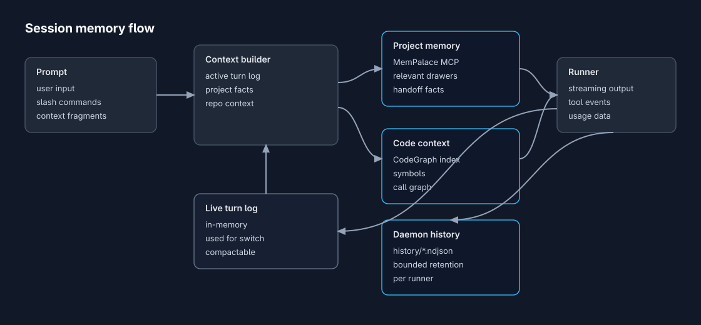
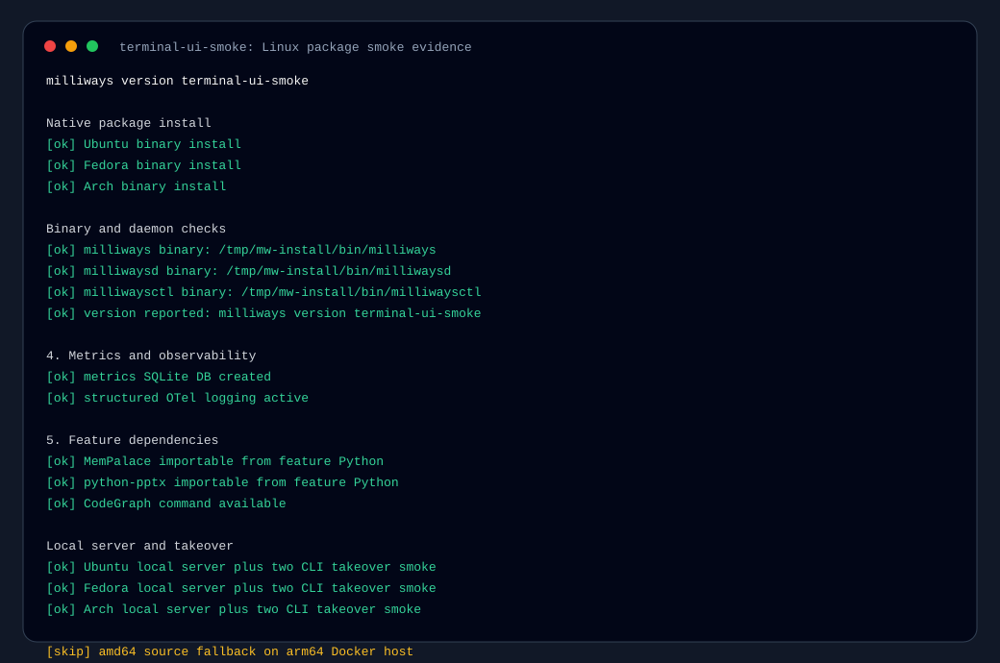
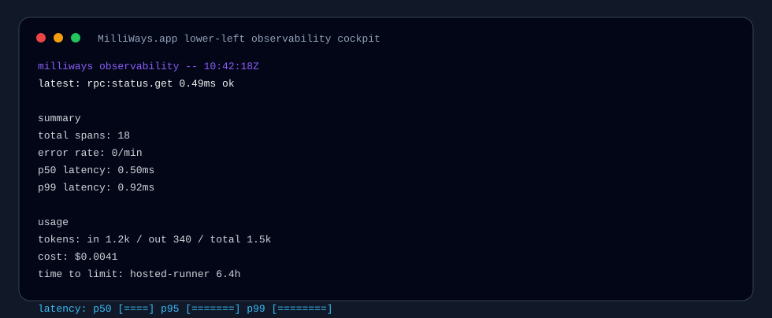
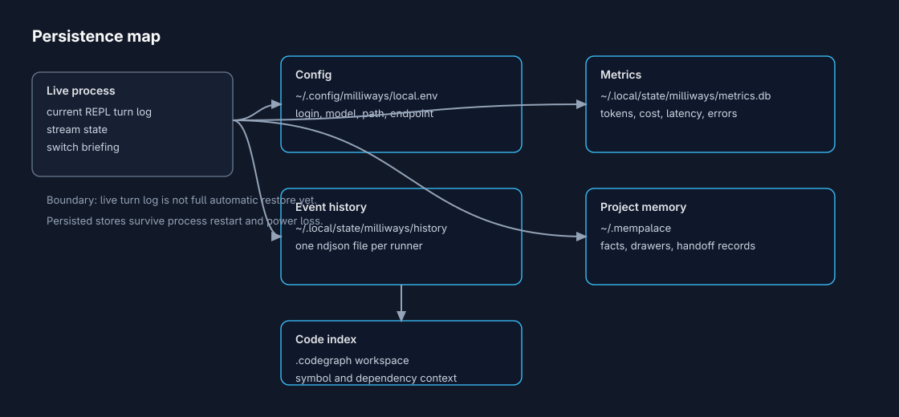
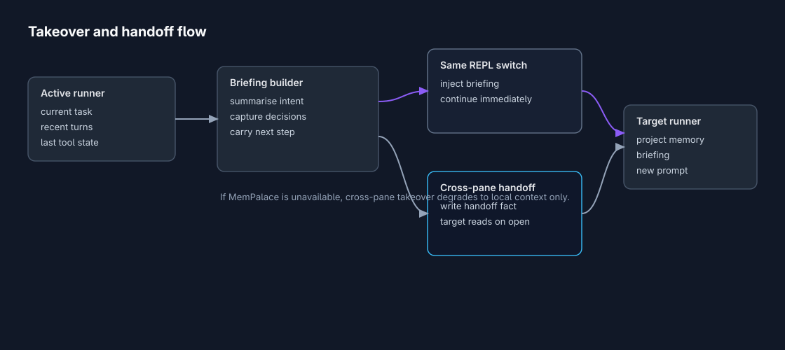

# Local AI work gets better when you can see what the system remembers

*Milliways now makes the hidden parts of local AI work visible: what context is live, what state is persisted, what gets handed off between runners, and what the daemon is actually doing under the hood.*

Most AI developer tools make the chat window feel like the whole product.

That is fine for a quick prompt. It gets less fine when you are deep in a codebase, switching between runners, restarting services, checking cost, or trying to understand why one agent knows something and another one does not.

That is the part I wanted Milliways to make clearer. Not with a big claim about perfect memory, but with a more useful product shape: show the developer where the context is, show what is durable, show what gets handed off, and show the operational signals while the work is happening.

This update is about that journey.

---

## Start with the context you actually have

When I am using local AI tools for development, the first question is not "does it have memory?" The better question is: which memory?

There is the live session context in the current terminal. There is state the daemon writes to disk. There is project memory through MemPalace when it is configured. There is code structure through CodeGraph after a workspace has been indexed.

Those are different things, and mixing them together creates bad expectations.

The picture above is the mental model I want a developer to have before trusting the tool with real work.

The prompt flows into a context builder. That builder can use the active turn log, project facts, and code context. The runner streams output back, while selected events and history can move into persisted stores.

The important detail is the boundary: the current REPL turn log is live session context. It is great for same-window switching and immediate continuation. It is not the same thing as saying every interactive transcript is magically restored forever.

That distinction is not just technical correctness. It is a better user experience, because the developer knows what they can rely on.

---

## Then prove the boring parts work

Before any of this matters, the install has to work.

For a local AI workspace, that means more than "the binary starts." The daemon needs to come up. The control CLI needs to reach it. Metrics need a place to land. Feature dependencies need to be available. The same package path needs to behave across common Linux targets.

This is why the Linux smoke exists. It is not glamorous, but it is the kind of evidence I want before asking people to put a tool into their daily loop.

| Check | Result |
|---|---|
| Ubuntu native package install | Passed |
| Fedora native package install | Passed |
| Arch native package install | Passed |
| `milliways`, `milliwaysd`, `milliwaysctl` installed | Passed |
| Version reports `terminal-ui-smoke` | Passed |
| Daemon socket created | Passed |
| `milliwaysctl ping`, `status`, `agents`, `metrics` | Passed |
| Metrics SQLite DB created | Passed |
| Structured telemetry logs present | Passed |
| MemPalace importable from feature Python | Passed |
| CodeGraph command available | Passed |
| `/pptx` validator, `/review`, `/drawio` checks | Passed |
| Ubuntu local server plus two-CLI takeover | Passed |
| Fedora local server plus two-CLI takeover | Passed |
| Arch local server plus two-CLI takeover | Passed |

From a product point of view, this is a confidence layer. If you are an AI developer trying to evaluate a local tool, you want to know that the control plane, package install, telemetry path, and handoff path are not just demo code.

---

## Keep operations in the same field of view

The next step is visibility while you work.

When an AI runner stalls, fails, burns tokens, or starts behaving differently, I do not want to leave the workspace to inspect a separate dashboard. I want the basic operational picture right beside the session.

The Milliways app now keeps observability in the lower-left cockpit. The top-left area is for runner navigation. The main area is still the prompt and stream. The operational signals sit close enough that they become part of the workflow instead of a separate admin task.

For an AI developer, these are the useful signals:

| Signal | Why it matters |
|---|---|
| Latest span | Confirms the daemon and control plane are alive |
| Error rate | Shows whether failures are systemic or isolated |
| P50/P99 latency | Shows normal and tail behavior |
| Tokens in/out | Shows recent context and generation volume |
| Cost | Shows spend without opening a separate dashboard |
| Time to limit | Shows projected quota pressure when quota caps exist |

This is meant to be practical, not decorative. The cockpit is backed by the same metrics and telemetry path used by `milliwaysctl metrics`.

That matters because AI development is already full of uncertainty. The tool should reduce the uncertainty around its own runtime.

---

## Know what survives a restart

The next question is persistence.

If you restart the daemon, close a pane, or come back to a project tomorrow, what is still there?

This map is deliberately explicit.

| State | Location | Status |
|---|---|---|
| Current REPL turn log | Process memory | Live only |
| Daemon event history | `~/.local/state/milliways/history/*.ndjson` | Persisted with bounded retention |
| Metrics and cost | `~/.local/state/milliways/metrics.db` | Persisted |
| Local settings | `~/.config/milliways/local.env` | Persisted |
| Project memory | `~/.mempalace` | Persisted when configured |
| Code context | `.codegraph` workspace | Persisted when indexed |

The business value here is straightforward: fewer surprises.

If the tool says metrics persist, they should persist in a known place. If project memory depends on MemPalace, that should be visible. If full interactive transcript restore is not the current capability, the product should not imply that it is.

That kind of honesty makes the system easier to adopt, because teams can reason about it.

---

## Hand off work without pretending it is magic

The final part of the journey is runner switching.

Different AI runners are good at different parts of development. Sometimes I want one model for planning, another for code changes, another for review, and a local runner for private or offline work.

The hard part is not launching another runner. The hard part is carrying the right context across.

Milliways handles this as a briefing flow.

1. The active runner has the current task and recent turn log.
2. Milliways builds a structured briefing with intent, decisions, and the next step.
3. For same-window switching, that briefing is injected directly into the target runner.
4. For cross-pane takeover, the daemon writes a handoff fact through MemPalace when configured.
5. The target runner reads project memory and the handoff briefing before continuing.

Again, the boundary matters. If MemPalace is unavailable, takeover still works inside the active process, but cross-pane continuity falls back to the local context available at that moment.

That is the kind of behavior I want from local AI infrastructure: useful by default, stronger when optional memory is configured, and clear about what happened.

---

## The user journey I care about

The ideal Milliways session should feel like this:

You open the app and pick the runner that fits the task. You can see the daemon is alive. You can see recent latency, token flow, cost, and errors. You know which context is live in the session. You know which state is persisted locally. You can switch runners with a structured handoff instead of starting from a blank prompt. And when something breaks, there is enough evidence on screen to debug the tool instead of guessing.

That is the real goal of this update.

Milliways is becoming a local AI runner workspace where the hidden parts are visible: memory, persistence, handoff, metrics, and runtime behavior.

For AI developers, that visibility is not a nice-to-have. It is what turns a clever terminal wrapper into infrastructure you can trust.
