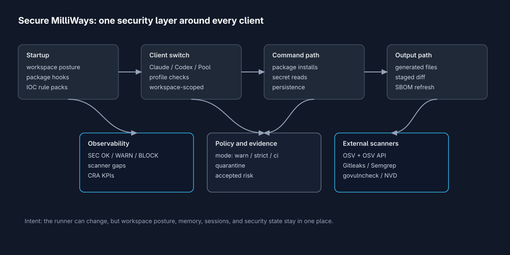
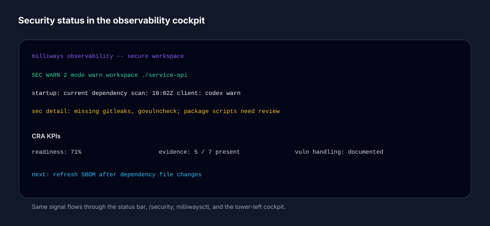
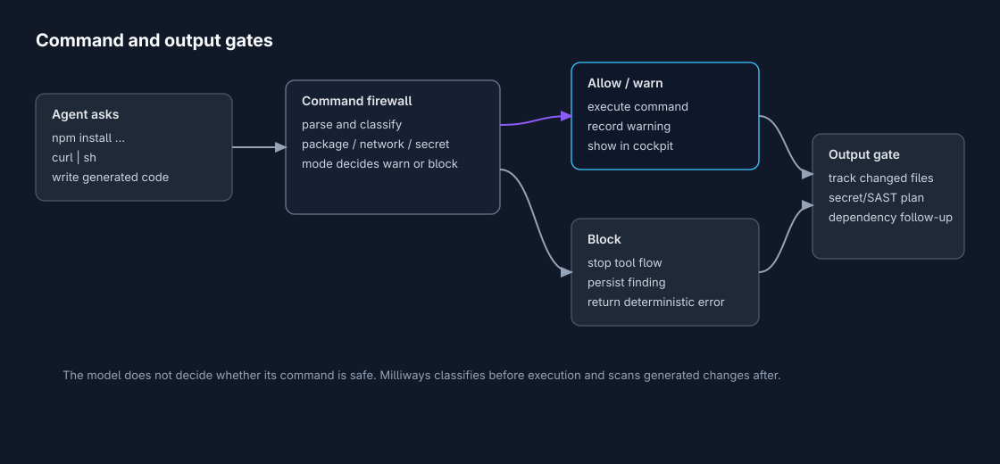

# Secure MilliWays: one security layer for every AI client

*Milliways is moving from "one terminal for every runner" to a stronger product promise: one place to route work, carry context, see operations, and manage security posture across every AI client you use.*

AI coding tools have become real workstation actors. They install packages, read files, run shell commands, call MCP servers, open browsers, write code, and carry instructions from one context into another.

That is useful. It is also a messy security shape.

Claude, Codex, Gemini, Copilot, Pool, MiniMax, and local models all have different safety models. Some expose sandboxes. Some expose auto-approval flags. Some run their own tools internally. Some depend on package managers and repo-local hooks. If you use several of them in the same codebase, the weakest boundary becomes the one you forgot to inspect.

Secure MilliWays is the answer I want in the terminal itself: all clients in one place, shared memory, shared sessions, one security layer.

Not a separate product. Not a claim that agentic coding is risk-free. A practical control plane that makes risk visible and gives the developer places to warn, block, scan, and recover.

---

## Why this belongs in the terminal

Security for AI coding cannot only live in the model prompt.

A prompt can tell an agent not to install suspicious packages. It can tell an agent not to read secrets. It can say tool output is untrusted. Those are useful instructions, but they are still instructions to a model.

Milliways owns a better place to enforce some of the boundary: the terminal and daemon layer around the clients.

That layer knows the workspace. It knows which client is active. It knows whether this is the first time the project has been opened. It knows the security mode. It can see generated files, staged changes, package manifests, local task runners, agent config, scanner availability, and observability state.

That is the right place to answer the everyday question:

> Is this workspace in a safe enough state to hand to an AI client?

---

## The layered model

The security model is intentionally layered because no single scanner catches this class of problem.

Startup scan is fast and local. It checks workspace and user-level surfaces before agent work starts: package scripts, `.claude/`, `.vscode/tasks.json`, package-manager policy, IOC files and domains, user systemd units, and macOS LaunchAgents.

Client profiles run when you switch clients. Claude hooks are different from Codex sandbox settings, which are different from a local model endpoint bound to a public interface. Milliways treats those as per-client posture checks, not generic lint.

The command firewall classifies risky commands before Milliways-controlled execution: package installs, persistence, secret reads, network download, shell eval, exfiltration patterns, known IOC destinations, and complex commands that are too messy to trust in strict mode.

The output gate looks at what changed after tools run. Generated files and staged changes can request secret scanning, SAST checks, dependency rescans, and SBOM refresh recommendations.

External scanners still matter. OSV, Gitleaks, Semgrep, govulncheck, the OSV API, and optional NVD enrichment all fit into the model. Milliways attaches to them instead of pretending it should reimplement them.

The important point is ownership: scanners provide evidence, but Milliways owns the cross-client status.

---

## The cockpit should show security too

If security state is hidden in a command you have to remember to run, most people will not see it at the moment it matters.

That is why security status is wired into the same observability story as tokens, cost, spans, latency, and runner errors.

The status bar and cockpit now have room for the practical signals:

| Signal | Why it matters |
|---|---|
| `SEC OK / WARN / BLOCK` | Tells you the current workspace posture without leaving the session |
| Startup scan state | Shows whether the first-workspace scan is required, stale, or current |
| Scanner gaps | Makes missing OSV, Gitleaks, Semgrep, or govulncheck visible |
| Client profile | Shows whether the active runner has known risky configuration |
| Warnings and blocks | Keeps security findings close to the work they affect |
| CRA KPIs | Turns compliance evidence into something a team can actually track |

This is not meant to turn the terminal into a compliance dashboard. It is meant to keep the minimum useful posture visible while the agent is working.

---

## The model does not judge its own shell command

One design rule matters a lot: the command firewall does not ask the model whether a command is safe.

It parses and classifies. Then policy mode decides what happens.

In `warn` mode, a risky action can be recorded and surfaced while work continues. That is the right default for developer laptops and noisy repos.

In `strict` or `ci`, known-bad IOC hits, persistence creation, secret reads, exfiltration patterns, and high-risk package commands can block when Milliways controls the execution path.

There is still an honest boundary here: external CLIs sometimes execute their own tools internally. Milliways cannot intercept every internal tool call unless that client exposes a controllable sandbox or command path. For those clients, Milliways runs profile checks, startup scans, command pre-flight where commands pass through Milliways, and output/security scans around the session.

That distinction matters. Security language should not imply more control than the software actually has.

---

## CRA readiness is evidence, not theatre

The EU Cyber Resilience Act changes the shape of product security work. Vulnerability scanning is only one input. Teams also need evidence for vulnerability handling, support/update posture, secure defaults, SBOMs, reporting readiness, and accepted risk.

Milliways treats CRA as an evidence layer above the scanners.

That means:

- `milliwaysctl security sbom` can generate local SPDX JSON from Go, Cargo, npm, pnpm, yarn, Bun, and Python manifests.
- `milliwaysctl security cra-scaffold` can create missing `SECURITY.md`, `SUPPORT.md`, update policy, and CRA technical file placeholders.
- `milliwaysctl security cra` reports readiness, gaps, and next actions.
- Observability shows concise CRA KPIs instead of burying them in a release checklist.

NVD can enrich CVE metadata. It should not be the compliance model. CRA readiness is about process evidence, product posture, and incident handling as much as vulnerability IDs.

---

## What this changes for daily work

The workflow should feel simple.

You open Milliways in a repo. The startup scan runs and the cockpit tells you whether the posture is OK, warning, or blocked. You switch to Codex or Claude and Milliways checks that client's risk profile before handoff. You ask the agent to work. Commands that pass through Milliways are classified before execution. Generated files can be scanned before you trust or commit them. If something suspicious appears, quarantine starts as a dry-run plan instead of an untracked cleanup script.

That is the product shape I want: less ceremony, more evidence, fewer hidden assumptions.

The point is not to make AI clients scary. The point is to stop pretending that every client, package manager, hook file, and generated diff is someone else's security boundary.

Milliways is already the place where runners, memory, sessions, and observability meet. Secure MilliWays makes security part of that same workspace.

---

*May 2026*

**[github.com/mwigge/milliways](https://github.com/mwigge/milliways)**
