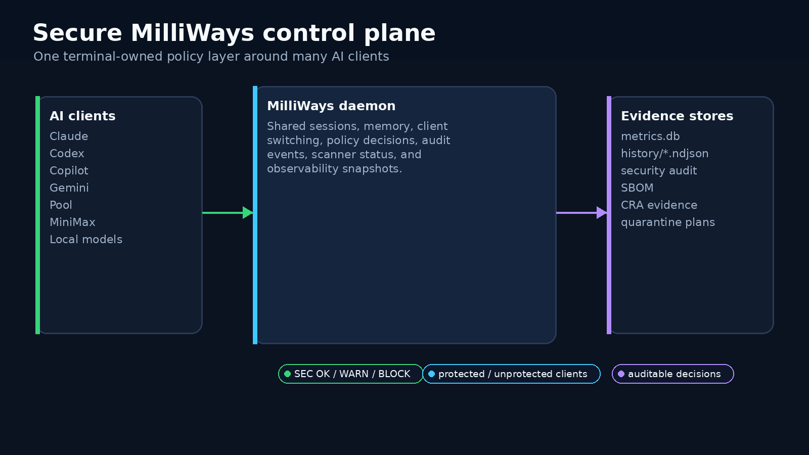
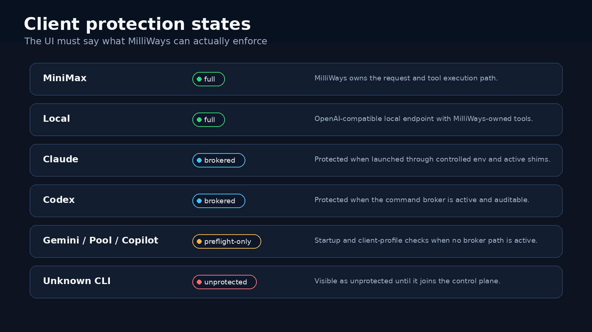
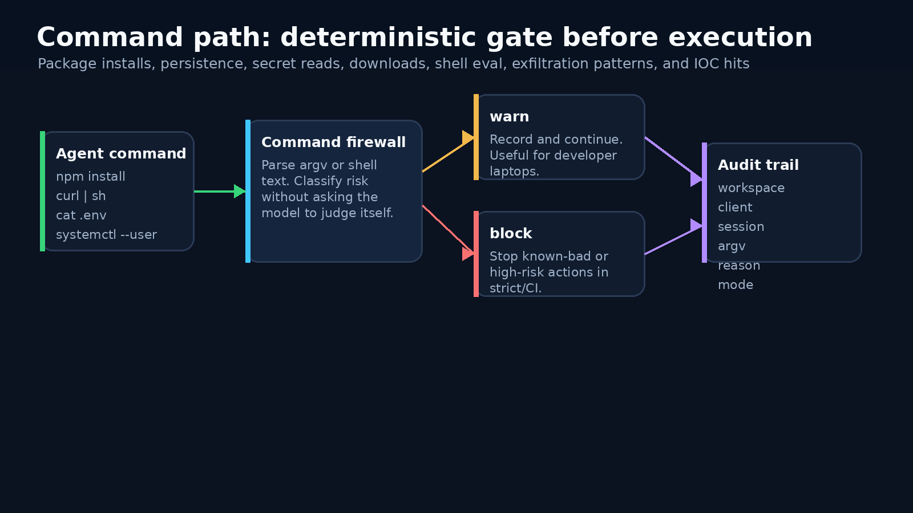
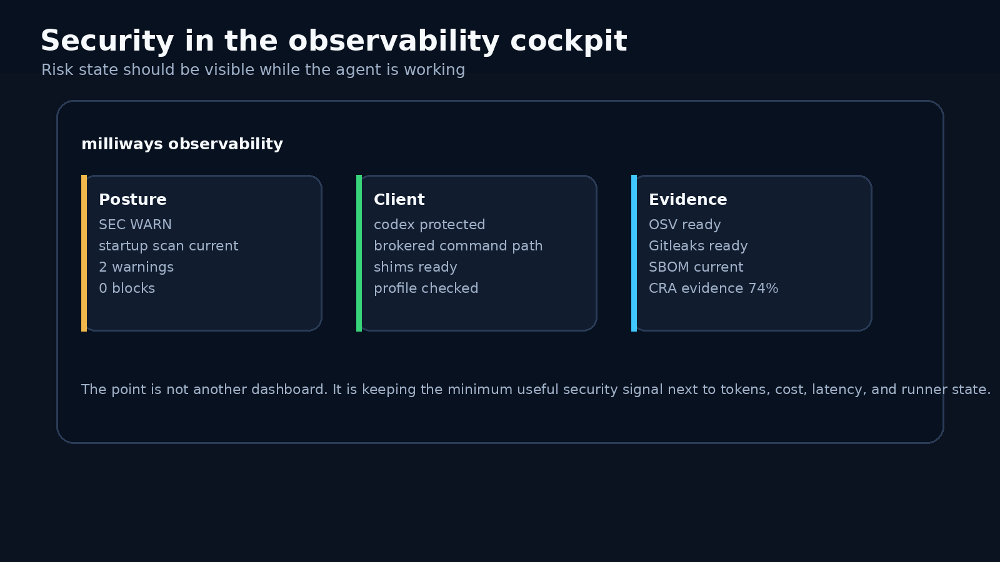
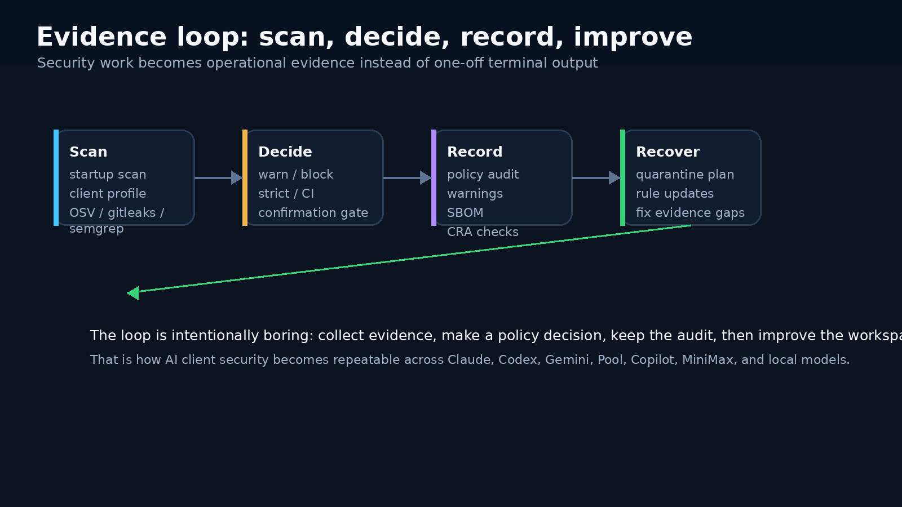

# Secure MilliWays and the AI client security control plane

*AI coding clients are becoming workstation actors. MilliWays puts them behind one visible control plane instead of asking every client to be its own security product.*

There are two ways to think about AI terminal security.

The first is client by client. Claude has one safety model. Codex has another. Gemini, Copilot, Pool, MiniMax, and local models all have their own shape too. You learn the flags, the sandbox settings, the package manager behavior, the config files, and the hooks for each one.

That works until you use more than one client in the same repo.

The second way is a control plane. The terminal knows the workspace. It knows which client is active. It knows whether this is first startup, whether command brokerage is active, whether scanners are installed, whether the startup scan is stale, and whether a policy decision was warned, blocked, or allowed.

That is the Secure MilliWays direction: all clients in one place, shared memory, shared sessions, one security control plane.

## Why the control plane matters

AI clients now run shell commands, install packages, write files, call MCP servers, read project configuration, and carry context across sessions. The risk is not just "will the model say something unsafe." The risk is operational: what can this client do on my machine, in this repo, right now?

Prompts still matter. Client-native sandboxes still matter. External scanners still matter.

But none of those are enough on their own.

MilliWays sits around the clients and gives the developer one operational view:

- Which clients are available?
- Which clients are protected by the MilliWays command path?
- Which clients are only covered by preflight and profile checks?
- Which scanners are installed?
- Which commands were warned or blocked?
- Which security evidence exists for the workspace?

The product idea is deliberately practical. Security should be visible during the work, not only after someone remembers to run a checklist.

## Protected has to mean something

The most important UI word here is `protected`.

It should not be marketing language. It should describe actual control-plane coverage.

MilliWays now treats client state more carefully:

| State | Meaning |
|---|---|
| `full` | MilliWays owns the request path and the tool execution path. MiniMax and local model tooling are in this category. |
| `brokered` | The external CLI is launched through a controlled environment and command shims are active, so command decisions can go through MilliWays policy and audit. |
| `preflight-only` | MilliWays can scan startup posture and client configuration, but the command broker is not active for that client path. |
| `unprotected` | MilliWays does not have enough information or control to claim protection. |

That distinction is not cosmetic. If a command shim is missing, if the broker is unavailable, or if a client is launched outside the controlled path, the UI should not imply that command execution is protected.

In the navigation panel, that means client names can show `codex (protected)` or `gemini (unprotected)` based on the enforcement metadata. In status, it means the user can see shim readiness and broker gaps instead of guessing from logs.

## The command path is deterministic

The command firewall does not ask the model whether a command is safe.

It parses the command path, classifies known risk patterns, applies policy mode, and records the result.

That gives MilliWays a place to catch everyday high-risk patterns:

- package installs and lockfile changes
- shell eval and download-to-shell patterns
- secret reads such as `.env` and key files
- persistence attempts like user services and launch agents
- exfiltration-shaped network commands
- IOC domains, files, and command fragments
- commands too complex to parse safely in strict mode

In `warn` mode, the decision can be surfaced and audited while the work continues. In `strict` or `ci`, the same policy can block high-risk actions.

The important part is repeatability. A command is evaluated as a command, with argv preserved where possible, not as a vibe check.

## Security belongs in the cockpit

Hidden security state is almost the same as absent security state.

If the developer has to remember a separate command at the exact moment risk appears, the system will miss too much. That is why Secure MilliWays connects security status to the same observability plane as tokens, cost, latency, spans, and runner errors.

The useful signals are small:

| Signal | Why it matters |
|---|---|
| `SEC OK / WARN / BLOCK` | Fast posture read while the agent is working. |
| Startup scan state | Shows whether the workspace has been checked recently. |
| Client protection | Shows whether the active client is protected, preflight-only, or unprotected. |
| Scanner gaps | Makes missing OSV, Gitleaks, Semgrep, or govulncheck visible. |
| Warnings and blocks | Keeps policy decisions close to the session that caused them. |
| CRA evidence | Turns product-security obligations into trackable local evidence. |

This is not meant to turn the terminal into a compliance suite. It is meant to keep the minimum useful truth visible.

## Evidence beats vibes

Secure MilliWays is designed around evidence.

The security control plane records policy decisions, scanner status, generated-shim audit events, SBOM data, warnings, blocks, and CRA readiness signals.

The loop is simple:

1. Scan the workspace and client profile.
2. Decide whether a command or output is acceptable.
3. Record the decision and the reason.
4. Use the evidence to fix the workspace, update rules, or quarantine suspicious output.

That matters for normal development and it matters for governance.

The EU Cyber Resilience Act is not just a CVE feed. Teams need evidence that they can handle vulnerabilities, provide support, update safely, maintain SBOMs, and explain product-security posture. MilliWays treats CRA readiness as a local evidence layer above scanners, not as a replacement for scanners.

## What changed in the implementation

The recent control-plane work tightened several things that matter in practice.

Generated command shims now fail closed if the broker is missing. A caller cannot skip policy by setting shim environment variables. The broker strips shim metadata before running the real command. Workspace policy is derived from the current directory unless the provided workspace actually contains it.

Policy audit filtering now happens in storage, before limit is applied, so older matching events are not hidden by newer unrelated events. Command-check and internal Bash firewall decisions are persisted into the same audit story.

Status surfaces now show shims and client enforcement. The navigation panel and `/security status` no longer have to pretend that every external CLI is equally protected.

The smoke test now invokes a generated shim path directly instead of only calling the broker command by hand.

That is the level where a security control plane becomes real: not only a diagram, but fail-closed defaults, durable audit, explicit state, and tests that exercise the path users actually run.

## The honest boundary

MilliWays does not make every external AI client fully controllable.

Some clients run internal tools behind their own process boundary. Some expose better sandbox controls than others. Some can be brokered through command shims. Some can only be checked before launch and scanned after output.

That is why the UI needs `protected`, `preflight-only`, and `unprotected` instead of one vague green badge.

The goal is not to replace Claude, Codex, Gemini, Copilot, Pool, MiniMax, local models, OSV, Gitleaks, Semgrep, or govulncheck. The goal is to make their security posture visible and operational in one place.

AI client security should not be scattered across seven CLIs, three package managers, a few hidden hooks, and a pile of terminal scrollback.

It should be part of the terminal where the work is happening.

That is Secure MilliWays.

---

*May 2026*

**github.com/mwigge/milliways**
