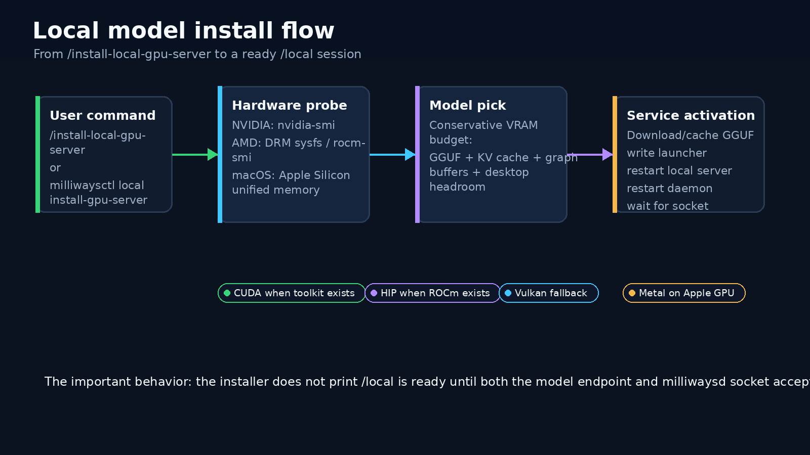
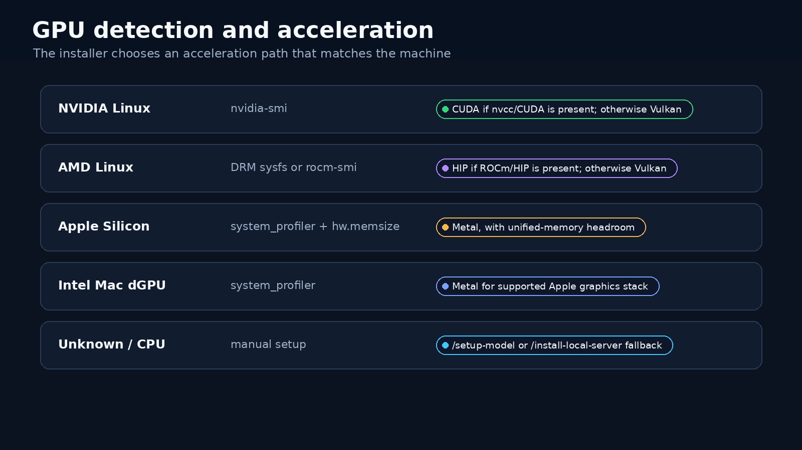
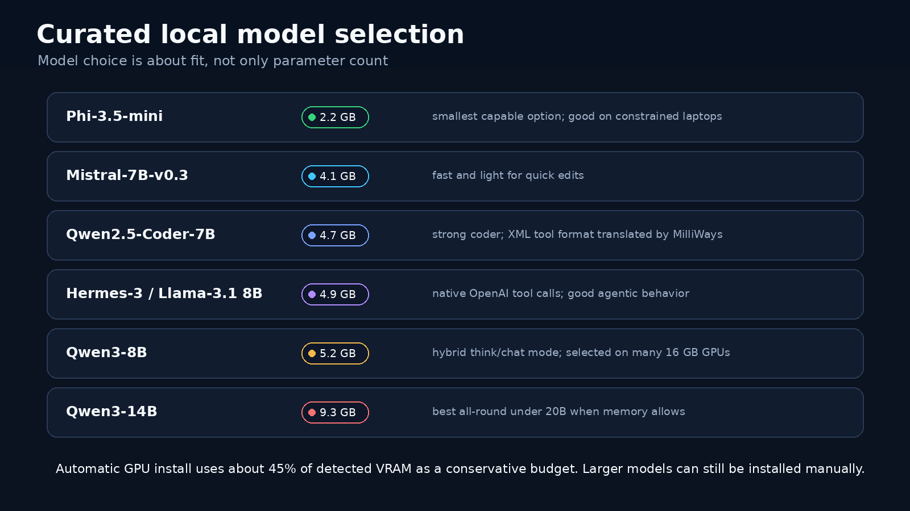
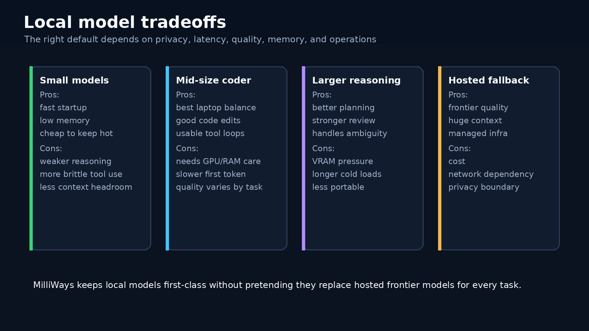

# Local models that install like part of the terminal

*Local models are useful only when they are boring to operate. MilliWays now treats hardware detection, model choice, service activation, and `/local` handoff as one install path.*

Running a local coding model should not require remembering which GPU vendor uses which llama.cpp backend, where the GGUF landed, which port the server chose, or whether the daemon has recreated its Unix socket after a restart.

The user-facing command is intentionally small:

```bash
/install-local-gpu-server
```

or, outside the chat UI:

```bash
milliwaysctl local install-gpu-server
```

That command probes the machine, picks a model that should fit, installs or refreshes the local service, restarts the relevant MilliWays services, waits for readiness, and then switches the chat session to `/local`.



## Hardware is the first decision

The installer starts by asking what kind of machine it is on. The answer changes both the acceleration path and the model budget.



On Linux NVIDIA systems, MilliWays reads `nvidia-smi` for VRAM and prefers CUDA when the CUDA toolchain is present. If CUDA is not available, Vulkan is the fallback.

On Linux AMD systems, it reads DRM sysfs and `rocm-smi` where available. HIP is used when ROCm/HIP is installed; otherwise Vulkan is the dependable path.

On macOS, it treats Apple Silicon as a unified-memory machine and uses Metal. That matters because a "16 GB GPU" Mac is not the same as a 16 GB discrete GPU. The OS, the browser, the terminal, and the model all draw from the same pool, so the budget has to leave visible headroom.

Unknown or CPU-only machines still have a path: `/install-local-server` for the default single-server setup, or `/setup-model <repo>` when the user wants to choose a GGUF manually.

## The model pick is conservative on purpose

The automatic GPU installer does not try to fill memory to the edge. It uses a conservative budget, roughly 45% of detected VRAM or unified memory, because loaded model size is not the whole cost. KV cache, graph buffers, context length, desktop compositing, and other apps all compete for memory.

That is why a 16 GB AMD or NVIDIA GPU commonly lands on Qwen3-8B Q4_K_M instead of a 14B model. The smaller choice is usually faster, less fragile, and more likely to survive real desktop use.



The curated set is deliberately practical:

| Model | Why it exists in the set | Cost |
|---|---|---|
| Phi-3.5-mini | Smallest capable fallback for constrained machines. | Lower reasoning ceiling. |
| Mistral-7B-v0.3 | Fast, light general model for short edits and chat. | Less code-specialized. |
| Qwen2.5-Coder-7B | Strong code model that fits modest GPUs. | Tool format needs translation, handled by MilliWays. |
| Hermes-3 / Llama-3.1 8B | Native OpenAI tool calls for agentic local runs. | Less specialized for code than coder models. |
| Qwen3-8B | Balanced coding, reasoning, and tool use; a good 16 GB GPU default. | Slower than lighter 7B-class choices. |
| Qwen3-14B | Better planning and review when memory allows. | More VRAM pressure and longer cold loads. |
| DeepSeek-Coder-V2-Lite | Useful for complex refactors and code reasoning. | Heavier operational footprint. |

The important part is that "largest fitting" does not mean "largest possible if nothing else is running." It means largest curated model inside a budget that should still leave the workstation usable.

## Install means refresh, not only first setup

The same command is safe to use as an install, upgrade, or reinstall. That matters when the machine already has an older `milliways-local-server`, an older systemd/launchd unit, or stale support scripts from a previous package.

The refresh path updates the support scripts, makes sure the required packages are present, refreshes the launcher, writes the endpoint environment, restarts the local server, restarts `milliwaysd`, and waits for the model endpoint and daemon socket before reporting success.

The user sees this while the services are settling:

```text
==> Waiting for services to finish installation...
[ok] milliwaysd restarted
[ok] /local is ready
```

That wait is there to avoid the broken-pipe failure mode where the chat UI tries to open `/local` while `milliwaysd` is between restart and socket creation. The chat client also retries reconnects across that restart window, so reinstalling should not leave the session pointing at a dead socket.

## The tradeoff is not local versus cloud

Local models are a capability, not a religion.



Small local models are fast, private, cheap to keep warm, and good enough for many mechanical edits. They are also easier to confuse, especially when tool use or broad reasoning is required.

Mid-size coder models are the laptop sweet spot. They can edit code, explain local files, and run without a network dependency. They still need careful context sizes, model choice, and service management.

Larger reasoning models can be better at planning, review, and ambiguous work. The cost is cold-start time, VRAM pressure, and more variability across consumer machines.

Hosted frontier models still win for very hard reasoning, huge context windows, and managed reliability. They also bring cost, network dependency, and a different privacy boundary.

MilliWays keeps those options in the same runner surface. `/local` is one runner beside Claude, Codex, Gemini, Copilot, Pool, and MiniMax, with the same model switching, status, memory, and security surfaces around it.

## What this changes in practice

The practical improvement is small but important: local models become something you can ask the terminal to set up, not a weekend project.

Use `/install-local-gpu-server --dry-run` when you want to see the hardware and model decision before changing anything. Use `/install-local-gpu-server` when you want the default path. Use `/install-local-server` on CPU-only or constrained machines. Use `/setup-model <repo>` when you know exactly which GGUF you want.

After that, `/local` should just work.

---

*May 2026*

**github.com/mwigge/milliways**
