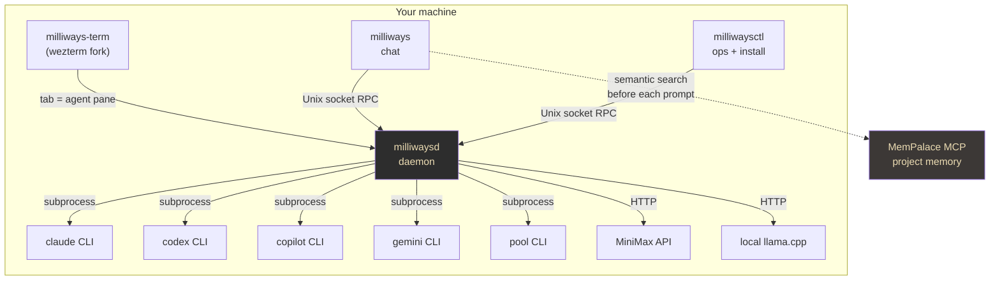
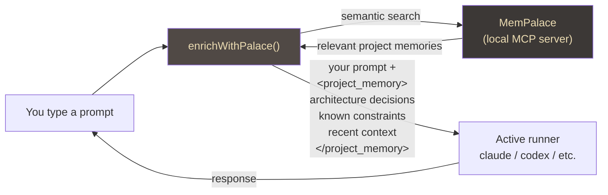
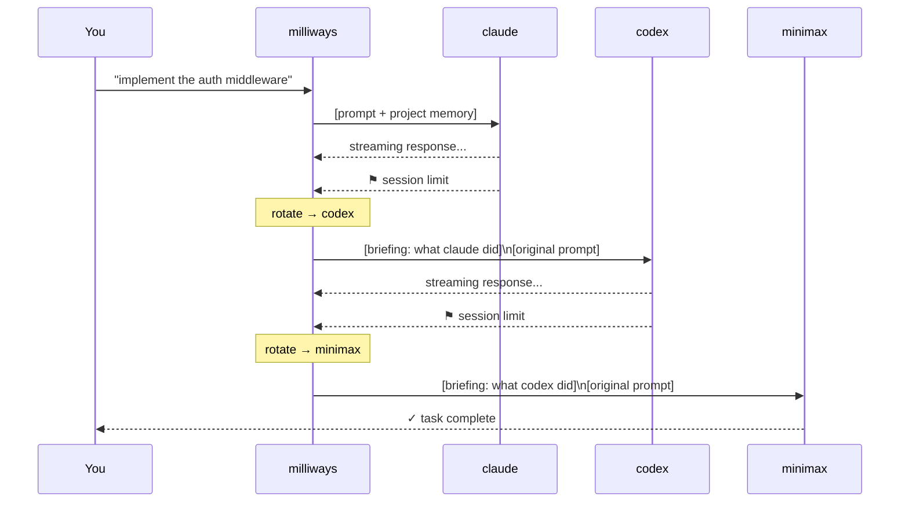
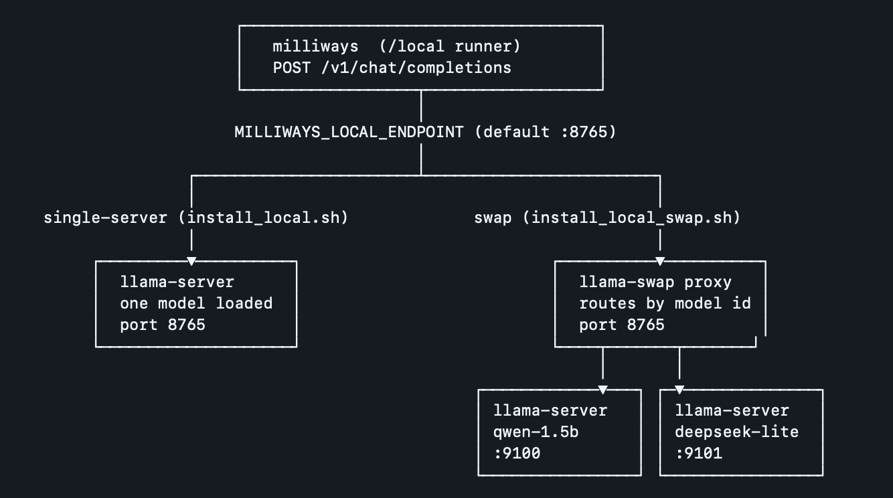
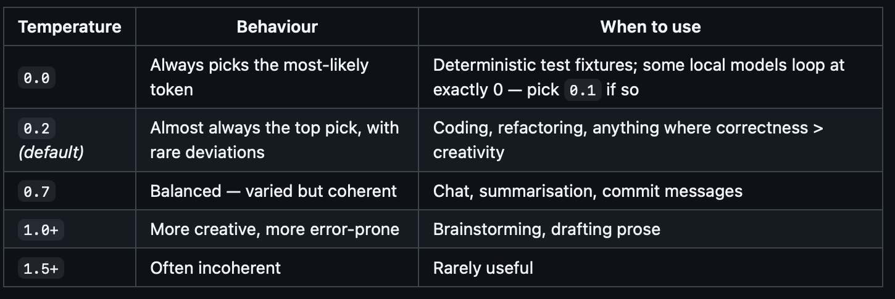

# Milliways — one terminal, every AI, zero context loss

*The elevator pitch for why a multi-runner AI terminal with shared memory changes how you work.*

---

## The problem with seven great tools

Claude reasons deeply. Codex grinds through code. Copilot knows your GitHub repos. Gemini is fast and cheap for search and summarisation. MiniMax runs without quotas. Pool indexes large codebases and holds architectural context across turns. Local llama.cpp runs completely offline on your hardware.

Every one of these is excellent at something. The problem is that they live in separate terminals, separate sessions, and separate contexts. When you switch from Claude to Codex, you start over. When Claude hits its session limit mid-task, you lose the thread. When you want Gemini's speed for a quick lookup but Claude's reasoning for the follow-up, you're copying and pasting between windows.

**Milliways solves this by making all seven runners feel like one.**

---

## Architecture: one daemon, any runner

The design is a local daemon that keeps all AI sessions alive simultaneously. Your terminal connects to the daemon over a Unix socket. You switch runners with a slash command — `/claude`, `/codex`, `/gemini` — and the daemon routes your prompt to the right process. No new terminal. No lost context. No re-authentication.



The runners are their own CLIs — milliways wraps them rather than reimplementing them. Claude's tooling, Codex's sandbox, Copilot's GitHub awareness — all preserved exactly as the vendor ships them. Milliways adds the routing layer and the shared context layer on top, without touching what makes each runner good.

---

## One memory, every runner

The reason switching runners feels seamless is shared project memory. Before milliways delivers any prompt to any runner, it queries **MemPalace** — a local MCP server — for project memories relevant to what you're asking. Those memories are injected as a `<project_memory>` block the runner sees as part of its context.

The runner doesn't know the memories came from elsewhere. It just sees context that makes it immediately useful in *your* project, not a generic codebase it has never encountered.



**The practical effect is that every runner starts informed.** Switch from Claude to Codex mid-session and Codex already knows your project structure, your architectural decisions, and the constraints you've established over months of work. You stop re-explaining yourself to every new tool.

Beyond project memory, milliways maintains a rolling turn log — the last twelve exchanges, regardless of which runner produced them. When you switch runners, that log is compiled into a structured briefing injected as the new runner's first message. The new runner knows not just the project, but exactly what you were doing five minutes ago.

---

## The rotation ring — uninterrupted flow across session limits

Every AI runner has limits: context windows, daily quotas, session timeouts. The rotation ring turns those limits from blockers into invisible transitions.

Configure a priority order once:

```
/ring claude,codex,minimax
```

When the active runner exhausts — hitting a session limit, context window, or quota — milliways automatically rotates to the next runner in the ring and re-dispatches your original prompt. You see a single notification line. The response keeps streaming.



The handoff is structured, not raw. Milliways builds a briefing from the turn log before rotating, and the incoming runner treats it as ground truth.

**Here's what that looks like in production.** A full code review of milliways — three runners, two manual switches, zero context loss:

```
→ codex  model: o4-mini  (codex CLI)

[codex] ▶  <code review in progress...>

[codex] ▶ /gemini
{"msg":"runner switch","from":"codex","to":"gemini"}
→ gemini  model: gemini-2.5-pro  (gemini CLI)  [briefing from codex]

[gemini] ▶  I've received the context. You were asking for a full code
             review of milliways. How would you like me to proceed?

[gemini] ▶  <deep review, lots of analysis...>

[gemini] ▶ /pool
{"msg":"runner switch","from":"gemini","to":"pool"}
→ pool  model: Poolside ACP  (pool CLI (ACP))  [briefing from gemini]

[pool] ▶  Thinking...

I see you've handed off a conversation with gemini that was in the middle
of a code review for the milliways project — a terminal emulator with a
Go backend and Rust frontend.

I should acknowledge the handoff and wait for the user's next prompt.
```

The chain is codex → gemini → pool. Three runners, three completely different architectures (OpenAI CLI subprocess, Google CLI subprocess, Poolside ACP HTTP client), and the briefing carried the full review context across all of them. Gemini acknowledged the handoff from codex immediately. Pool narrated its own onboarding — it read the briefing, understood what was in progress, and correctly decided to wait for the next prompt.

No re-prompting. No copy-pasting. The user typed `/gemini`, then `/pool`. That was it.

---

## Local model behaviour steering

Local models — llama.cpp, Ollama, vLLM, LMStudio — are first-class runners in milliways, not an afterthought. The local runner speaks the OpenAI-compatible `/v1/chat/completions` API, which means any backend that implements it works out of the box.

### Two deployment modes



There are two ways to run local models:

**Single-server** (`/install-local-server`) — one `llama-server` instance, one model loaded, port 8765. Simple, low overhead. Switching models means restarting the server.

**Swap** (`/install-local-swap`) — a `llama-swap` proxy sits at port 8765 and routes requests by model id to individual `llama-server` instances on different ports. Multiple models can be registered; the proxy loads and evicts them on demand. Switch models live with `/model local <name>` — no restart, no reconfiguration.

The swap mode is what makes the local runner genuinely useful as part of the rotation ring. You can have a fast small model (Qwen-1.5b) for quick iterations and a larger reasoning model (DeepSeek-Coder-lite) for deeper analysis, both accessible in the same session.

### Temperature — the most useful control



Temperature is the one parameter that matters most for code work. Too high and the model invents APIs. Too low and it loops or refuses to paraphrase. The defaults are tuned for a developer workflow:

The key insight for local models: `0.2` is the right default for coding tasks. It keeps output deterministic enough to be reliable but avoids the edge cases some models exhibit at exactly `0.0`. Switch to `0.7` when you want the model to draft prose, write commit messages, or brainstorm — anything where variation is a feature rather than a bug.

Set it live, without restarting anything:

```
/local-temp 0.2       # coding, refactoring
/local-temp 0.7       # commit messages, summaries
/local-temp default   # let the server decide
```

### All the runtime controls

| Command | Effect |
|---|---|
| `/local-temp <value\|default>` | Sampling temperature — persists across restarts |
| `/local-max-tokens <N\|off>` | Cap reply length; `off` for unrestricted output |
| `/local-endpoint <url>` | Point at a different backend live |
| `/local-hot on\|off` | Keep all models resident vs evict on TTL |
| `/model local <name>` | Switch model without restarting the server |

All of these write to `~/.config/milliways/local.env` and survive daemon restarts. The `/model local` command shows the current settings — endpoint, model, temperature, max tokens — so you always know the exact state.

The combination of a local runner with shared MemPalace memory is particularly powerful: a Qwen2.5-Coder instance at `temp=0.2` with your full project context injected produces code that looks like it was written by someone who actually read the codebase — because from its perspective, it has.

---

## Observability — you can see everything that's happening

Most AI tools are black boxes. Milliways instruments every interaction with OpenTelemetry and exposes a live metrics dashboard, so you know exactly what is running, what it costs, and how it's behaving.

### Gen AI semantic spans

Every dispatch to a runner produces a structured OTel span following the Gen AI semantic conventions. The parent span covers the full dispatch — model, system (anthropic / openai / google / etc.), token counts, cost in USD. Each tool call the runner makes produces a child span.

```
gen_ai.client.operation  [claude · claude-opus-4-5]
  ├── gen_ai.execute_tool  [bash]          12ms
  ├── gen_ai.execute_tool  [read_file]      3ms
  ├── gen_ai.execute_tool  [write_file]     8ms
  └── gen_ai.execute_tool  [bash]          41ms
  input_tokens: 4821  output_tokens: 892  cost_usd: 0.0183
```

This means every agent action — every file read, every shell command, every web fetch a runner executes — is a traceable, queryable event. When something goes wrong, you have the full trace, not just a response string.

### Live metrics dashboard

The `/metrics` command (or `milliwaysctl metrics --watch`) shows a rolling table of activity across all runners, updated every five seconds:

```
milliwaysctl metrics

runner      1 min    1 hour    24 h      7 d       30 d
─────────────────────────────────────────────────────────
claude      2 ops    14 ops    89 ops    312 ops   1.2k ops
            $0.04    $0.31     $2.14     $7.82     $29.40
codex       0 ops    3 ops     21 ops    88 ops    340 ops
                     $0.00     $0.08     $0.31     $1.22
gemini      1 ops    8 ops     44 ops    180 ops   690 ops
            $0.00    $0.01     $0.07     $0.28     $1.09
```

Five time windows — 1 min, 1 hour, 24 hours, 7 days, 30 days — backed by a SQLite store with tiered rollup (raw → hourly → daily → weekly → monthly). The data is always on disk. You can query spend across any window without waiting for a billing cycle.

### Terminal title as ambient signal

The terminal tab and title bar carry live session state, visible even when the terminal is in the background:

| State | Tab | Window title |
|---|---|---|
| Switched to runner | `milliways · claude` | `● claude · opus-4-5` |
| Prompt sent | `milliways · claude · thinking…` | `● claude · opus-4-5` |
| Streaming | `milliways · claude · streaming…` | `● claude · opus-4-5` |
| Response done | `milliways · claude · $0.0183 session · 4.8k→0.9k tok` | `● claude · opus-4-5` |
| Ring rotation | `milliways · rotating → codex` | `↻ codex` |

The tab shows the running session cost so you always know your spend without opening the metrics dashboard. The window title shows the compact runner+model for the OS window switcher.

---

## What you get

```
[⚡ woke 3m ago] [≈≈ MW v1.0.1] [~/project] [●claude] [1:C 2:X 3:G 4:M 5:L]
```

- **Seven runners** — claude, codex, copilot, gemini, pool, minimax, local — all in the same terminal session
- **Shared project memory** — MemPalace context injected before every prompt, to every runner
- **Automatic rotation ring** — session limits and quota exhaustion become seamless handoffs, not interruptions
- **Runtime local model steering** — temperature, token limits, and endpoint switchable live without restarts
- **Full observability** — OTel Gen AI spans per dispatch, per tool call; live `/metrics` dashboard across five time windows; cost always on disk
- **Ambient session state** — tab title shows running cost, tokens, and live status; visible from any window
- **Native Linux packages** — `.deb`, `.rpm`, `.pkg.tar.zst` on every release, one-liner installer that auto-detects your distro

The goal is a single surface where the question is never "which tool do I open" but only "what do I want to build."

---

*v1.0.1 — May 2026*

**[github.com/mwigge/milliways](https://github.com/mwigge/milliways)**
