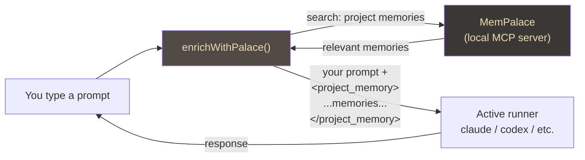
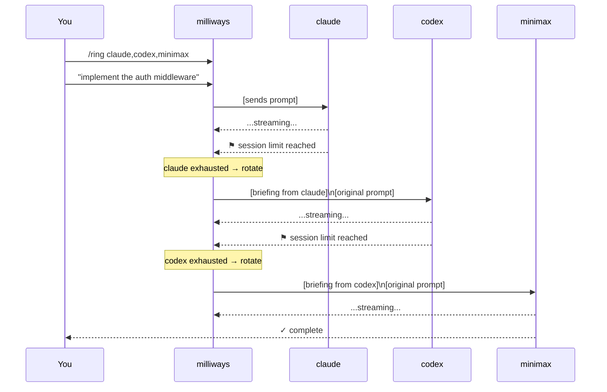

# Milliways — the restaurant at the end of the universe

*A casual write-up for my own memory. Not press-ready, not polished. Just an honest account of what I built and why it works the way it does.*

---

## The problem it solves

I was paying for Claude, Codex, Copilot, Gemini, and MiniMax simultaneously. Each one is great at something different. Claude reasons well. Codex grinds through code changes. Gemini is cheap and fast for searches and summaries. Copilot knows your GitHub repos. MiniMax doesn't care about quotas when it's 2am and Claude has told you to come back tomorrow.

The problem: they're all different UX, different CLIs, different session models. You can't switch between them without losing your train of thought. When Claude hits its context limit mid-task, you don't want to start over — you want to hand off. When you've been working with one AI for an hour and it exhausts its session, the ideal outcome is that the next one *already knows what you were doing*.

That's the whole premise of Milliways. One terminal. Seven runners. One continuous context.

---

## The big picture

The core architecture is simple on paper: a daemon sits in the middle and handles all the routing. The client (your terminal) talks to the daemon over a local Unix socket. The daemon spawns the actual AI processes and streams their output back.


The client and the daemon are two separate binaries on purpose. The daemon runs as a background process and keeps all the AI sessions alive. If you close the terminal, the daemon keeps running. If you open a new tab, it connects to the same daemon and picks up the existing sessions.

The CLI runners (claude, codex, copilot, gemini, pool) are just their normal CLIs — milliways doesn't reimplement them. It wraps them, captures their output over a PTY, and streams it back as structured events. MiniMax and local llama.cpp go over HTTP instead.

---

## One memory for all of them

The thing that makes the multi-runner setup actually usable is shared memory. Every runner shares the same project memory, and it gets injected before every prompt automatically.

The memory store is MemPalace — an MCP server I have running locally. Before milliways sends your prompt to whatever runner is active, it queries MemPalace for relevant memories about the current project, wraps them in a `<project_memory>` XML block, and prepends it to your message. The runner never knows the memory came from somewhere else. It just sees context.



The practical effect: you can switch from Claude to Codex mid-session and Codex immediately knows the project context. You don't have to re-explain what you're building. The memory is there, it's the same memory, and both runners see the same picture.

There's a turn log too — a rolling buffer of the last 12 exchanges. When you switch runners, milliways builds a structured briefing from that buffer and injects it as the new runner's first message. So Codex doesn't just know the *project* context, it knows *what you were literally doing five minutes ago*.

---

## The rotation ring — automatic failover that actually works

The ring is the part I'm most pleased with. The idea: you configure a priority order, and when a runner hits its session limit, quota, or context window, milliways automatically rotates to the next one and re-dispatches your prompt. No interruption. You just see a one-line message in the terminal and the response keeps streaming.



The "briefing" is the critical piece. When a runner exhausts, milliways doesn't just re-send your raw prompt to the next one. It builds a structured handoff:

```
[briefing from claude → codex]
Recent exchange:
  user: implement the auth middleware
  claude: Added JWT validation in internal/auth/middleware.go...

Continue from here. The user's next prompt follows.
---
implement the auth middleware
```

The new runner reads that briefing as its first message. It knows what the previous runner was doing. It picks up in the middle, not from scratch.

---

## The session limit cycle in practice

Here's a real scenario from a couple of weeks ago. I was doing a fairly large refactor — probably four or five hours of back-and-forth. I had the ring set to `claude,codex,minimax`.

1. Claude took the first couple of hours. Hit its context limit partway through a particularly complex change to the database layer.
2. Codex took over automatically. Got the briefing, picked up where Claude left off. Ran for about 45 minutes before it hit a session limit.
3. MiniMax finished the job.

None of those transitions required me to do anything except glance at the terminal when the handoff notification appeared. Total context preserved end-to-end.

The terminal tab showed `↻ codex` briefly when the rotation happened — that's the tab title flash I added so you can see it even if the terminal is in the background. After the rotation completes it settles back to `● codex · model-name`.

---

## What's actually installed

When you install milliways, you get three binaries:

- **`milliways`** — the chat and one-shot CLI dispatch. This is what you type in the terminal.
- **`milliwaysd`** — the daemon. Starts automatically when you open a tab or run `milliways`.
- **`milliwaysctl`** — the ops tool. Installs AI CLIs (`/install claude`), manages local models, queries metrics.

On Linux, the install packages these into a proper `.deb`, `.rpm`, or `.pkg.tar.zst` depending on your distro. On macOS, the one-liner also drops **MilliWays.app** into `/Applications` — a wezterm fork where every tab opens the AI terminal by default, the status bar shows which runner is active, and there are keyboard shortcuts for switching runners and pulling up the command palette.

The status bar on MilliWays.app looks like this:

```
[⚡ woke 3m ago] [≈≈ MW v1.0.1] [~/project] [●claude] [1:C 2:X 3:G 4:M 5:L]
```

Left to right: wake badge (appears for 5 minutes after sleep/wake), milliways version, current directory, active runner, runner shortcut keys.

---

## The things that were actually hard

**Thread safety on ring rotation.** The auto-rotation fires from the stream-reading goroutine when it detects a session-limit message. But `switchAgent()` touches readline state, which must only be called from the main goroutine. First version had a data race. Fixed it with a `rotateCh` channel — the stream goroutine sends the next runner name to the channel, and the main readline loop drains it.

**Fedora's Go packaging.** When you build from source on Fedora, it sets `GOSUMDB=off` in a system-level `/usr/lib/golang/go.env` file. `GOENV=off` and `unset GOSUMDB` both failed to override it because they only affect the user-level env file, not the system one. The fix: explicitly `export GOSUMDB=sum.golang.org` in the installer, which takes priority over everything.

**The Python subprocess security hole.** The `/pptx` command asks the active runner to write a python-pptx script, then executes it. Original version: no timeout, full ambient environment (every API key and AWS credential accessible). The script could have done anything. Fixed: 30-second timeout, stripped environment (only PATH/HOME/TMPDIR/LANG forwarded), Python AST validator that allowlists imports before execution.

**Terminal tab titles on Fedora in wezterm.** OSC 0 sets the tab title, OSC 2 sets the window title. Kitty and wezterm both understand this. But wezterm ignores OSC sequences for the tab bar unless you register a `format-tab-title` Lua event handler that reads `pane.title`. Without the handler, the tab always shows the process name. One Lua event registration fixed it.

---

## Current state

Seven runners: claude, codex, copilot, gemini, pool, minimax, local. Rotation ring works. Shared memory works. Tab/window titles live-update with cost and tokens. Linux packages ship as native `.deb`/`.rpm`/`.pkg.tar.zst` on every release.

The thing I actually use every day. The runners stop feeling like separate tools and start feeling like one system with a bad memory that compensates by keeping notes.

---

*v1.0.1 — May 2026*
