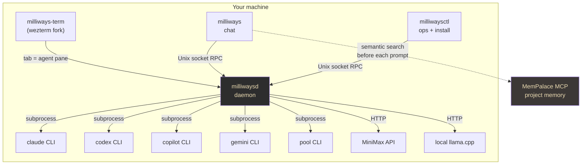
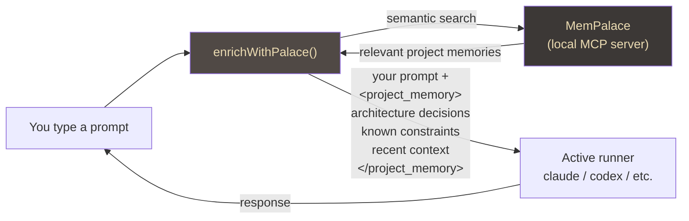
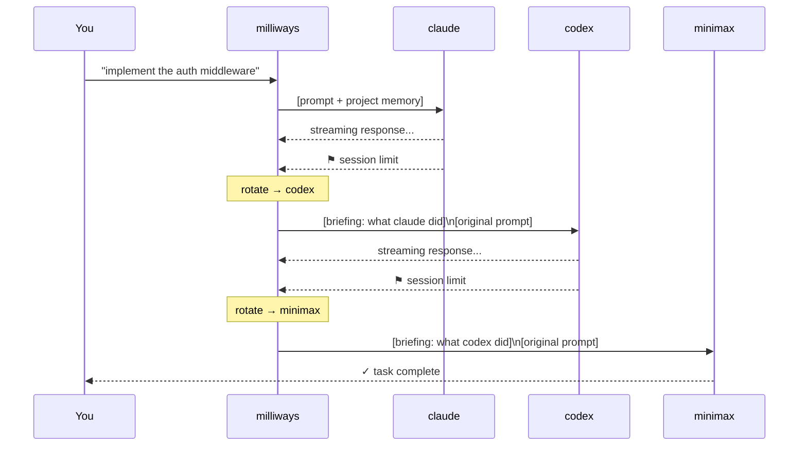

# Milliways — one terminal, every AI, zero context loss

*The elevator pitch for why a multi-runner AI terminal with shared memory changes how you work.*

---

## The problem with seven great tools

Claude reasons deeply. Codex grinds through code. Copilot knows your GitHub repos. Gemini is fast and cheap for search and summarisation. MiniMax runs without quotas. Pool indexes large codebases and holds architectural context across turns. Local llama.cpp runs completely offline on your hardware.

Every one of these is excellent at something. The problem is that they live in separate terminals, separate sessions, and separate contexts. When you switch from Claude to Codex, you start over. When Claude hits its session limit mid-task, you lose the thread. When you want Gemini's speed for a quick lookup but Claude's reasoning for the follow-up, you're copying and pasting between windows.

**Milliways solves this by making all seven runners feel like one.**

---

## Architecture: one daemon, any runner

The design is a local daemon that keeps all AI sessions alive simultaneously. Your terminal connects to the daemon over a Unix socket. You switch runners with a slash command — `/claude`, `/codex`, `/gemini` — and the daemon routes your prompt to the right process. No new terminal. No lost context. No re-authentication.



The runners are their own CLIs — milliways wraps them rather than reimplementing them. Claude's tooling, Codex's sandbox, Copilot's GitHub awareness — all preserved exactly as the vendor ships them. Milliways adds the routing layer and the shared context layer on top, without touching what makes each runner good.

---

## One memory, every runner

The reason switching runners feels seamless is shared project memory. Before milliways delivers any prompt to any runner, it queries **MemPalace** — a local MCP server — for project memories relevant to what you're asking. Those memories are injected as a `<project_memory>` block the runner sees as part of its context.

The runner doesn't know the memories came from elsewhere. It just sees context that makes it immediately useful in *your* project, not a generic codebase it has never encountered.



**The practical effect is that every runner starts informed.** Switch from Claude to Codex mid-session and Codex already knows your project structure, your architectural decisions, and the constraints you've established over months of work. You stop re-explaining yourself to every new tool.

Beyond project memory, milliways maintains a rolling turn log — the last twelve exchanges, regardless of which runner produced them. When you switch runners, that log is compiled into a structured briefing injected as the new runner's first message. The new runner knows not just the project, but exactly what you were doing five minutes ago.

---

## The rotation ring — uninterrupted flow across session limits

Every AI runner has limits: context windows, daily quotas, session timeouts. The rotation ring turns those limits from blockers into invisible transitions.

Configure a priority order once:

```
/ring claude,codex,minimax
```

When the active runner exhausts — hitting a session limit, context window, or quota — milliways automatically rotates to the next runner in the ring and re-dispatches your original prompt. You see a single notification line. The response keeps streaming.



The handoff is structured, not raw. Milliways builds a briefing from the turn log before rotating:

```
[briefing from claude → codex]
Recent exchange:
  user: implement the auth middleware
  claude: Added JWT validation in internal/auth/middleware.go,
          introduced a TokenClaims struct, wired into the router...

Continue from here. The user's next prompt follows.
```

The incoming runner picks up mid-task. A four-hour refactor that burns through three runners' session limits is indistinguishable from a single uninterrupted session.

---

## Local model behaviour steering

Local models — llama.cpp, Ollama, vLLM, LMStudio — are first-class runners in milliways, not an afterthought. Beyond just routing prompts to a local endpoint, milliways exposes runtime controls that let you steer model behaviour without restarting anything:

| Command | Effect |
|---|---|
| `/local-temp 0.2` | Low temperature for deterministic code generation |
| `/local-temp 0.8` | Higher temperature for brainstorming and drafting |
| `/local-temp default` | Let the server decide |
| `/local-max-tokens 2048` | Cap reply length for fast iteration |
| `/local-max-tokens off` | Unrestricted for long-form output |
| `/local-endpoint <url>` | Point at a different backend live |
| `/local-hot on` | Keep all models resident (sub-second switching) |
| `/local-hot off` | Evict models on TTL (saves VRAM when idle) |

All of these persist across daemon restarts. The `/model local` command shows the current settings at a glance, so you always know what the model is configured to do.

The combination of a local runner with shared MemPalace memory is particularly powerful: a local Qwen2.5-Coder instance, steered with low temperature and your full project context injected, produces code that looks like it was written by someone who actually read the codebase.

---

## What you get

```
[⚡ woke 3m ago] [≈≈ MW v1.0.1] [~/project] [●claude] [1:C 2:X 3:G 4:M 5:L]
```

- **Seven runners** — claude, codex, copilot, gemini, pool, minimax, local — all available in the same terminal session
- **Shared project memory** — MemPalace context injected before every prompt, to every runner
- **Automatic rotation ring** — session limits and quota exhaustion become seamless handoffs, not interruptions
- **Runtime local model steering** — temperature, token limits, and endpoint switchable live
- **Live cost tracking** — cumulative session spend in the tab title; per-response tokens in the inline hint
- **Native Linux packages** — `.deb`, `.rpm`, `.pkg.tar.zst` on every release, with a one-liner installer that auto-detects your distro

The goal is a single surface where the question is never "which tool do I open" but only "what do I want to build."

---

*v1.0.1 — May 2026*
